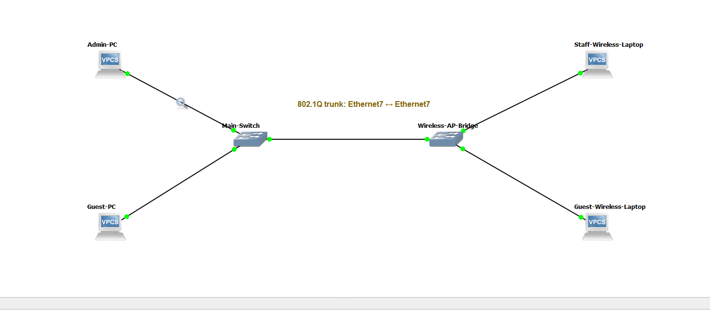
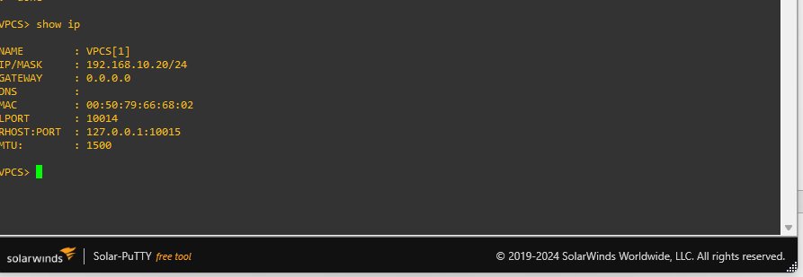
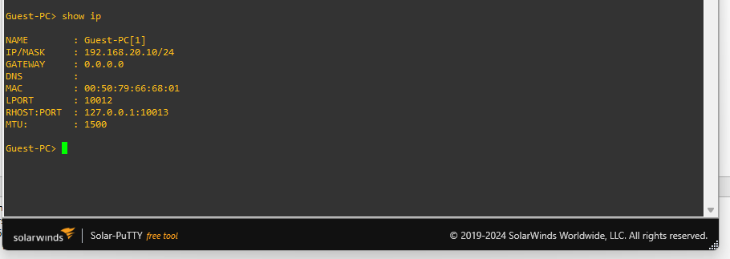
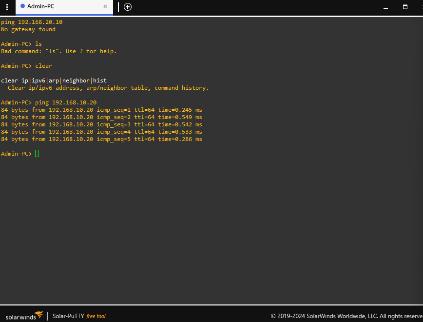
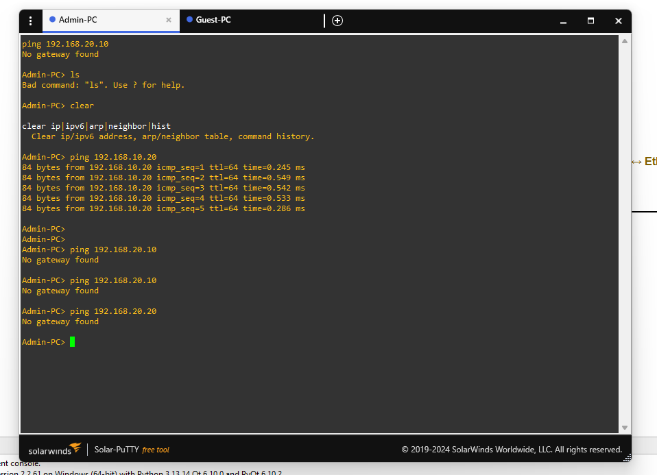
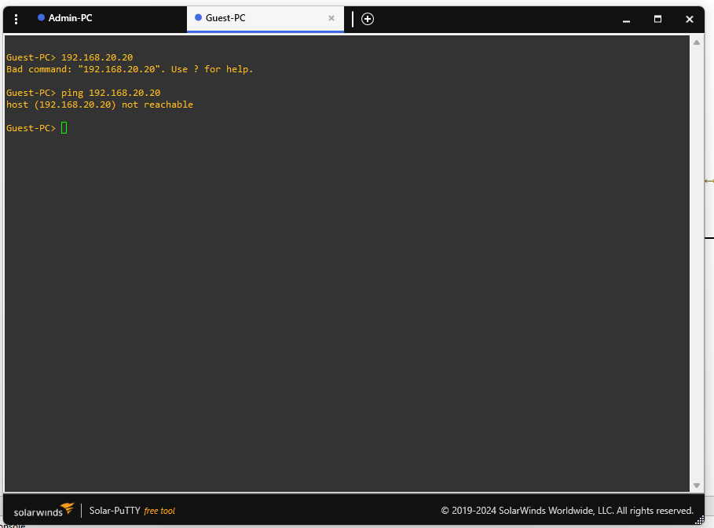
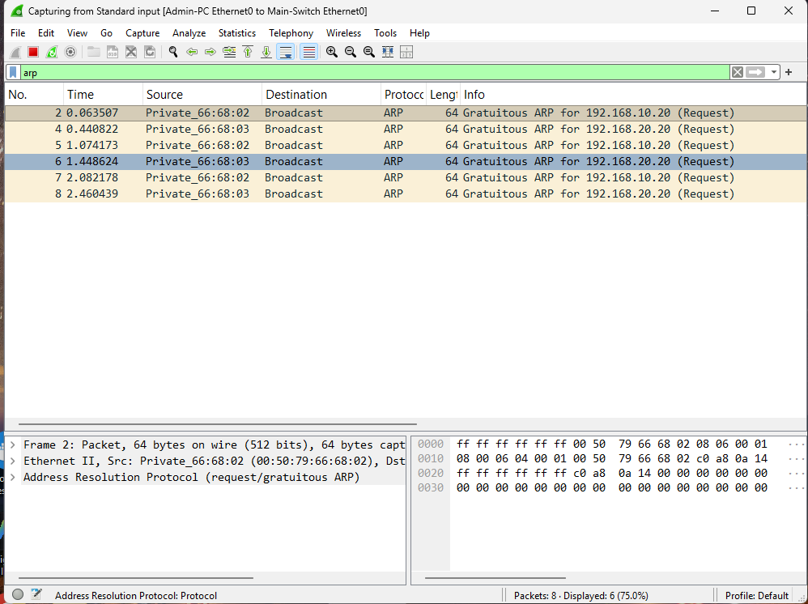
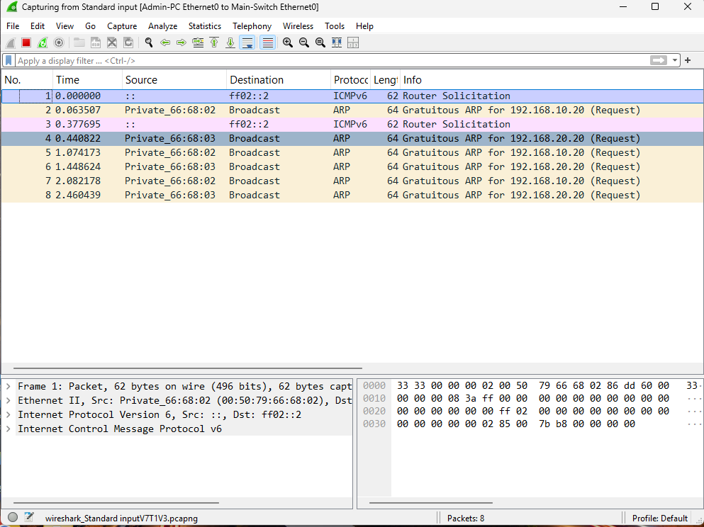

# Enterprise LAN Segmentation and Wireless Bridging Architecture

> A GNS3 proof of concept for enforcing Layer 2 segmentation, validating 802.1Q VLAN boundaries, and using packet analysis to confirm how ARP and ICMP behave across isolated broadcast domains.

## Executive summary

This project models an enterprise access-layer network in GNS3 and validates a core infrastructure-hardening principle: departments and trust zones should not share one unrestricted broadcast domain.

The design separates Staff and Guest endpoints into VLAN 10 and VLAN 20, carries the VLANs across an 802.1Q trunk, and represents wireless access through a Layer 2 bridge. The base topology intentionally has no router or Layer 3 switch. As a result, same-VLAN communication can succeed while cross-VLAN communication fails at the routing boundary. That behavior is verified through endpoint testing and Wireshark packet captures rather than assumed from the diagram.

The repository is structured as an engineering proof of concept. It records the topology, control objectives, validation matrix, packet-analysis findings, troubleshooting decisions, and evidence required to reproduce the result.

## Project naming options

The repository currently uses the display title above. Suitable professional repository names include:

1. `enterprise-lan-segmentation-architecture` — Layer 2 segmentation and wireless bridging proof of concept for enterprise access networks.
2. `gns3-vlan-isolation-packet-analysis` — Validates 802.1Q isolation, ARP behavior, and ICMP reachability with packet-level evidence.
3. `secure-access-layer-wireless-bridge` — Demonstrates access-layer zoning, wireless-to-Ethernet bridging, and routing-boundary enforcement.

## Architecture and topology

The simulated environment uses two logical trust zones:

| Zone | VLAN | Intended population | Security objective |
|---|---:|---|---|
| Staff | 10 | Authorized employee endpoints | Permit approved internal services while limiting exposure to Guest traffic |
| Guest | 20 | Untrusted or visitor endpoints | Keep guest traffic in a separate broadcast domain with no direct Staff reachability |

### Reference topology

```text
                  Staff access ports
        ┌──────────────────────────────────┐
        │ Staff Endpoint 1  VLAN 10        │
        │ Staff Endpoint 2  VLAN 10        │
        └───────────────┬──────────────────┘
                        │
                 ┌──────▼──────┐
                 │ Main-Switch │
                 │ L2 switching │
                 └──────┬──────┘
                        │ 802.1Q trunk
                        │ VLAN 10 and VLAN 20
                 ┌──────▼─────────────┐
                 │ Wireless-AP-Bridge │
                 │ Layer 2 bridge     │
                 └──────┬─────────────┘
                        │
        ┌───────────────▼──────────────────┐
        │ Guest Endpoint 1  VLAN 20        │
        │ Guest Endpoint 2  VLAN 20        │
        └──────────────────────────────────┘

        No router or Layer 3 switch is present in the base topology.
        Inter-VLAN communication is therefore not expected to succeed.
```

### Component responsibilities

- **VPCS endpoints:** Generate controlled test traffic and provide a simple, repeatable endpoint view.
- **Main-Switch:** Learns source MAC addresses and forwards or floods Ethernet frames within the appropriate VLAN.
- **802.1Q trunk:** Preserves VLAN identity when multiple logical networks traverse one physical link.
- **Wireless-AP-Bridge:** Represents the Layer 2 bridge between a wireless access segment and the Ethernet LAN. GNS3 does not simulate radio propagation, interference, authentication, or client association in this topology.
- **Absent Layer 3 gateway:** Demonstrates the boundary between switching and routing. A router, Layer 3 switch, or firewall would be required to permit controlled inter-VLAN communication.

## Visual evidence gallery

The following repository-owned captures document the topology, endpoint addressing, baseline connectivity tests, and packet-level observations. The gallery is intentionally limited to evidence relevant to this project; the complete evidence index remains in [`evidence/README.md`](evidence/README.md).

All published images were reviewed for personal names, email addresses, local file paths, desktop and taskbar context, account identifiers, and location metadata. The remaining addresses are simulated RFC1918 lab values.

### Topology and endpoint configuration

<p align="center">
  
</p>

*Evidence shown: the four-endpoint topology, the Main-Switch, the simulated wireless bridge, and the annotated 802.1Q trunk path.*

<table>
  <tr>
    <td width="50%"></td>
    <td width="50%"></td>
  </tr>
  <tr>
    <td><b>Staff endpoint addressing</b><br>VLAN 10 uses the simulated 192.168.10.0/24 subnet.</td>
    <td><b>Guest endpoint addressing</b><br>VLAN 20 uses the simulated 192.168.20.0/24 subnet.</td>
  </tr>
</table>

### Connectivity validation

<table>
  <tr>
    <td width="50%"></td>
    <td width="50%"></td>
  </tr>
  <tr>
    <td><b>Same-VLAN reachability</b><br>Staff endpoint communication succeeds within VLAN 10.</td>
    <td><b>Cross-VLAN boundary</b><br>Cross-VLAN attempts return <code>No gateway found</code> in the unrouted baseline topology.</td>
  </tr>
  <tr>
    <td colspan="2"></td>
  </tr>
  <tr>
    <td colspan="2"><b>Investigation state</b><br>The initial Guest VLAN same-segment failure is preserved as troubleshooting evidence. It is not presented as proof that the Guest path is complete; the root-cause analysis and retest remain open.</td>
  </tr>
</table>

### Packet analysis

<table>
  <tr>
    <td width="50%"></td>
    <td width="50%"></td>
  </tr>
  <tr>
    <td><b>ARP broadcast observation</b><br>ARP requests are visible as broadcasts for the simulated VLAN endpoint addresses.</td>
    <td><b>Supplemental protocol view</b><br>This capture also contains ICMPv6 router solicitation traffic; it is included as supplemental packet evidence, not as IPv4 ICMP proof.</td>
  </tr>
</table>

## Security control analysis through the OSI model

### Layer 1 Physical

Physical cabling and port placement establish the first trust boundary. In a production network, access to switch closets, patch panels, wireless infrastructure, and unused ports must be controlled. The GNS3 topology abstracts the physical layer, but the design still separates endpoint roles by logical access ports.

### Layer 2 Data Link

Layer 2 is the primary control plane demonstrated by this project. VLAN 10 and VLAN 20 create separate broadcast domains. The switch uses learned MAC addresses and VLAN membership to decide where frames may be forwarded. An 802.1Q trunk carries multiple VLANs while preserving the VLAN tag between switching or bridging components.

This design limits the reach of broadcast traffic and reduces the size of a Layer 2 attack surface. It does not, by itself, provide complete security. Production hardening should also consider access-port restrictions, unused-port shutdown, port security, DHCP snooping, Dynamic ARP Inspection, BPDU Guard, storm control, and explicit trunk VLAN allow-lists.

### Layer 3 Network

Layer 3 routing is the enforcement point for communication between VLANs. Because the base topology has no router, firewall, or Layer 3 switch, a Staff host cannot resolve or reach a Guest host as an ordinary routed flow. This is an intentional design boundary, not a connectivity defect.

In an enterprise deployment, inter-VLAN routing should terminate on a firewall or controlled Layer 3 gateway. That gateway is where security policy, access-control lists, inspection, logging, and identity-aware controls can be applied. Segmentation reduces lateral movement opportunities, but the gateway policy determines which business flows are permitted.

### Layer 4 Transport and Layer 7 Services

The base validation focuses on ARP and ICMP, but the same boundary applies to TCP and UDP applications. A future firewall implementation should log permitted and denied sessions, identify unexpected Staff-to-Guest or Guest-to-Staff connection attempts, and forward those events to a centralized monitoring platform.

## Packet analysis with Wireshark

### Expected ARP behavior

ARP resolves an IPv4 address to a destination MAC address on the local Layer 2 segment. A host sends an ARP request as a broadcast, and the request should remain inside the originating VLAN. The expected behavior is:

1. A Staff endpoint broadcasts an ARP request for a local Staff peer.
2. The switch floods the frame only to eligible ports in VLAN 10.
3. The destination replies with an ARP response addressed to the requesting host.
4. The switch learns the source MAC locations and forwards subsequent unicast frames more selectively.

An ARP request from VLAN 10 should not be visible to VLAN 20 endpoints. That containment is observable in Wireshark and provides packet-level evidence that the broadcast domains are separated.

### Expected ICMP behavior

- Same-VLAN ICMP should succeed when IP addressing and endpoint configuration are correct.
- Cross-VLAN ICMP should fail in the base topology because no Layer 3 gateway exists to route between VLAN 10 and VLAN 20.
- A failed cross-VLAN ping is meaningful evidence of the routing boundary; it is not sufficient by itself to prove that every switch control is correct.

Useful Wireshark display filters include:

```text
arp
icmp
arp || icmp
eth.addr == <endpoint-mac>
ip.addr == <endpoint-ip>
```

Replace the placeholders with addresses observed in the GNS3 topology. Do not publish real personal or production addresses.

### Layer 2 attack relevance

ARP spoofing or poisoning attempts rely on the ability to influence address-resolution behavior within a broadcast domain. VLAN segmentation does not eliminate ARP attacks, but it limits their immediate scope. A Guest VLAN attack should not directly poison Staff hosts across the VLAN boundary. Production defenses should combine segmentation with DHCP snooping, Dynamic ARP Inspection, static bindings for critical systems, switch telemetry, and monitoring for unusual ARP changes.

## Validation matrix

| Test | Expected result | Evidence |
|---|---|---|
| Staff host to Staff host | Success within VLAN 10 | VPCS output and ICMP capture |
| Guest host to Guest host | Success within VLAN 20 | VPCS output and ICMP capture |
| Staff host to Guest host | Failure without Layer 3 routing | Ping result, ARP observation, topology note |
| Staff ARP request | Visible only in VLAN 10 | Wireshark `arp` capture |
| Guest ARP request | Visible only in VLAN 20 | Wireshark `arp` capture |
| Intentional VLAN error | Reproduce, isolate, and correct | Before/after screenshots and troubleshooting log |
| Wireless bridge path | Layer 2 forwarding behavior is observable | Topology screenshot and packet evidence |

Actual endpoint addresses, MAC addresses, switch-port settings, and the intentional error must be recorded from the supplied GNS3 project and captured evidence.

## Key skills demonstrated

- GNS3 topology construction and validation
- Ethernet switching and MAC address learning
- 802.1Q trunking and VLAN segmentation
- Broadcast-domain analysis
- ARP and ICMP packet analysis in Wireshark
- Wireless-to-Ethernet Layer 2 bridging
- Troubleshooting an intentional VLAN configuration error
- OSI model control mapping
- Network telemetry collection and evidence handling
- Translating lab results into enterprise hardening recommendations

## Security hardening expansion

The next iteration will add an open-source firewall such as pfSense between the VLANs. The firewall will become the explicit Layer 3 gateway and policy enforcement point. Staff-to-Guest and Guest-to-Staff flows will be denied by default, with narrowly scoped exceptions documented by business purpose. Logging will capture permitted and denied flows, policy matches, and anomalous connection attempts.

Endpoint telemetry will be expanded with Sysmon on Windows endpoints and a controlled log-collection pipeline. Elastic Stack will ingest firewall, Windows, and Sysmon events so the project can correlate a denied cross-VLAN connection with the initiating process, host, user context, and destination. Detection ideas include repeated denied connections between trust zones, unexpected management protocols, ARP-table changes, and unusual Guest-to-Staff scanning behavior.

This enhancement moves the project from demonstrating segmentation boundaries to demonstrating segmentation enforcement, endpoint visibility, centralized telemetry, and analyst-driven detection.

## Evidence and reproducibility

The final portfolio package should include:

- a clean GNS3 topology screenshot;
- sanitized `arp` and `icmp` Wireshark captures;
- endpoint test results for same-VLAN and cross-VLAN communication;
- before-and-after evidence for the intentional VLAN error;
- a troubleshooting log explaining the root cause;
- a short technical walkthrough video;
- a final report written in clear engineering language.

Course-provided project and Word files remain outside this public repository unless redistribution is permitted. The repository stores my own topology notes, observations, analysis, screenshots, captures, and final report.

## Project status

| Area | Status |
|---|---|
| Repository structure | Complete |
| Enterprise framing | Complete |
| Topology validation | Topology screenshot captured; baseline behavior partially validated |
| Wireshark captures | Sanitized ARP screenshot captured; reproducible `.pcap` files pending |
| Screenshots and video | Screenshots captured; walkthrough video pending |
| Hardening expansion | Planned |

### Evidence status

The current evidence package supports these bounded claims:

- the four-endpoint topology and 802.1Q trunk are documented in `topology/gns3-topology.png`;
- an Admin-PC to Staff-VLAN endpoint ICMP test succeeds;
- Admin-PC attempts toward Guest-VLAN addresses fail with `No gateway found`, consistent with the intentionally unrouted VLAN boundary;
- an initial Guest-VLAN same-segment failure is captured and remains under investigation;
- Wireshark shows ARP broadcasts for the observed `192.168.10.20` and `192.168.20.20` addresses.

The repository does not yet claim a completed guest-path fix, a finalized switch-configuration audit, or a reproducible packet-capture file. Those are the next validation gates.
