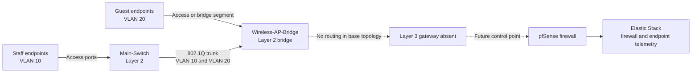

# Enterprise Segmentation Reference Design

```mermaid
flowchart LR
    S1[Staff endpoints<br/>VLAN 10] -->|Access ports| SW[Main-Switch<br/>Layer 2]
    S2[Guest endpoints<br/>VLAN 20] -->|Access or bridge segment| AP[Wireless-AP-Bridge<br/>Layer 2 bridge]
    SW -->|802.1Q trunk<br/>VLAN 10 and VLAN 20| AP
    AP -.->|No routing in base topology| R[Layer 3 gateway absent]
    R -.->|Future control point| FW[pfSense firewall]
    FW --> SIEM[Elastic Stack<br/>firewall and endpoint telemetry]
```

The dotted path identifies the planned hardening expansion rather than a component present in the base GNS3 topology.
